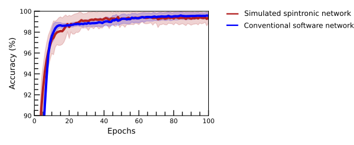

# RF spintronic neural networks
This repository contains the code to simulate hardware artificial neural networks where neurons and synapses are implemented by radiofrequency spintronic devices. 

The RF spintronic neural network concept and experimental demonstration can be found in the article "Multilayer spintronic neural networks with radio-frequency connections" by Ross, Leroux et al. [1], available [here](https://arxiv.org/abs/2211.03659)

In particular, this code can be used to reproduce the results of the drone classification task, which dataset can be downloaded [here](https://zenodo.org/record/7646236#.Y-4QbBOZOqU) and is inspired from [2].

## Setup  
In order to avoid potential conflicts with other packages it is strongly recommended to use a [virtual environment (venv)](https://docs.python.org/3/tutorial/venv.html) or a [conda environment](https://docs.conda.io/projects/conda/en/latest/user-guide/tasks/manage-environments.html).
The dependencies are:
- [Python](https://www.python.org/) 3.11
- [Pytorch](https://pytorch.org/) 2.0.1
- [Optuna](https://optuna.org/) 3.1.1
- [scikit-learn](https://scikit-learn.org/stable/index.html) 1.2.2
- [matplotlib](https://matplotlib.org/) 3.7.1
- [h5py](https://docs.h5py.org/en/latest/build.html) 3.7.0
- [pandas](https://pandas.pydata.org/) 1.5.3

The *requirements.yml* file can be used to create the environment with the command:

```
conda create --name environment_name --file requirements.yml
conda activate environment_name
```

## Usage
The code can run three different procedures:  
- Selection of the best hyper-parameters followed by training and evaluation of a network on the entire dataset  
```  
python main.py --procedure select_train_eval  
```  
- Training and evaluation of a network  
```  
python main.py --procedure train_eval  
```  
- Evaluation of an existing model (need to load one) on the test dataset
```  
python main.py --procedure eval  
```  
  
The configuration file contain all the simulation parameters. The two different models can be selected by editing the field *model* either spintronic network (spinMLP) or a standard neural network (MLP).  
  
By default, the physical model do not consider the nonidealities of the magnetic tunnel junctions. To take into account the nonidealities you have to use the flag --with-nonidealities:  
  
```  
python main.py --procedure select_train_eval --with-nonidealities
```  
  
The nonidealities that are implemented as the variation of the resonance frequencies, the variation of the frequency and the power of the output signal of the oscillators. It can be adjusted using  
  
```  
python main.py --procedure select_train_eval --with-nonidealities --freq-var-percentage 0.001 --power-var-percentage 0.001  
```  
where 1.0 corresponds to 100%.  
The results are saved in the *results* directory where there is one directory for each procedure.  
  
## Reproduce the procedure used to obtain the results of Figure 4 of our paper.  


  
Disclaimer: While it is possible for us to reproduce exactly the accuracy given in the paper, the results are not **exactly** reproducible if the code run on an other machine. This is actually a known issue (see [Pytorch forum](https://discuss.pytorch.org/t/reproducibility-over-different-machines/63047)). However, it is expected that you find very close results.  
  
In order to reproduce the training and evaluation procedure for the spintronic MLP and the standard MLP, we need two commands:  
- Execute the code with the spintronic MLP model:  
```  
python main.py --procedure train_eval --config config_spinMLP.yaml
```  
  
- Execute the code with the standard MLP model:  
```  
python main.py --procedure train_eval --config config_MLP.yaml  
```  
  
The results will be saved in the directory results/train_eval under the names YYYYmmdd-HHMMSS-<model_name>.  
  
## References  
[1] Ross, A., Leroux, N., de Riz, A., Marković, D., Sanz-Hernández, D., Trastoy, J., ... & Grollier, J. (2022). "Multilayer spintronic neural networks with radio-frequency connections". arXiv preprint arXiv:2211.03659.

[2] S. Basak, S. Rajendran, S. Pollin and B. Scheers, "Drone classification from RF fingerprints using deep residual nets," _2021 International Conference on COMmunication Systems & NETworkS (COMSNETS)_, Bangalore, India, 2021, pp. 548-555, doi: 10.1109/COMSNETS51098.2021.9352891.
[link to dataset](https://github.com/sanjoy-basak/dronesignals).  
